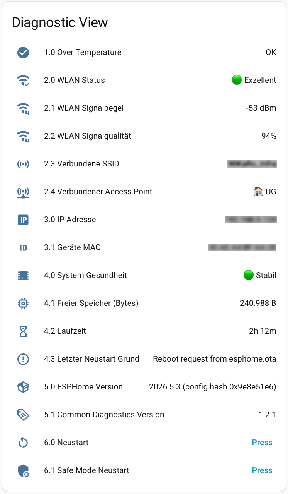

# 🩺 Common Diagnostics (ESPHome Package)


[](https://esphome.io/)
[](https://opensource.org/licenses/MIT)

Dieses Paket stellt eine zentralisierte Sammlung von Diagnose- und Überwachungssensoren für alle ESPHome-Projekte bereit. Durch die Auslagerung in ein "Common Package" bleibt der Code in den eigentlichen Projektdateien übersichtlich (DRY-Prinzip: Don't Repeat Yourself).

---

## ⚠️ Haftungsausschluss (Disclaimer)

**WICHTIGER HINWEIS: VERWENDUNG AUF EIGENE GEFAHR!**

Alle in diesem Repository bereitgestellten Inhalte, Codes und Konfigurationen sind rein private Bastelprojekte. Die Nutzung, der Nachbau sowie das Einspielen des bereitgestellten Codes erfolgen ausdrücklich auf **eigene Gefahr und eigenes Risiko**. Es wird keinerlei Haftung für Fehler, Systemabstürze oder andere Schäden übernommen.

---

## 📋 Inhaltsverzeichnis

* [Überblick](#überblick)
* [Vorschau in Home Assistant](#vorschau-in-home-assistant)
* [Verfügbare Sensoren & Entitäten](#verfügbare-sensoren--entitäten)
* [Einbindung in Projekte](#einbindung-in-projekte)
* [Substitutions (Grenzwerte anpassen)](#substitutions-grenzwerte-anpassen)
* [Access Point Namensauflösung](#access-point-namensauflösung)
* [Versionierung](#versionierung)

---

## 🔭 Überblick

Das `diagnostics.yaml` Package wird beim Kompilieren (Flashen) automatisch in das jeweilige Endgerät eingefügt. Es liefert Home Assistant detaillierte Einblicke in die "Gesundheit" des Mikrocontrollers. So lassen sich Probleme wie schlechter WLAN-Empfang, ständige Neustarts oder ein vollgeschriebener Arbeitsspeicher (Heap) frühzeitig erkennen.

Die Sensoren sind standardmäßig der Kategorie **`diagnostic`** zugeordnet. Sie tauchen in Home Assistant also nicht auf dem Haupt-Dashboard auf, sondern sauber sortiert unter den Gerätediagnosen.

---

## 📸 Vorschau in Home Assistant



---
## 📊 Verfügbare Sensoren & Entitäten

Alle Entitäten sind mit einem Nummern-Prefix versehen, das die Sortierung auf der Home Assistant Geräteseite nach thematischen Gruppen erzwingt. **Kategorie 1.x ist für projektspezifische Sensoren reserviert** und wird nicht vom Common Package belegt.

| Prefix | Gruppe |
|--------|--------|
| `1.x` | 🔧 Reserviert für lokales Projekt |
| `2.x` | 📶 WLAN & Konnektivität |
| `3.x` | 🌐 Netzwerk-Identifikation |
| `4.x` | 🧠 System & Speicher |
| `5.x` | 🏷️ Versionen |
| `6.x` | 🔘 Steuerung |

### 2.x – WLAN & Konnektivität
* **2.0 WLAN Status:** Ampel-Bewertung (🟢 Exzellent / 🟡 Okay / 🔴 Kritisch) anhand konfigurierbarer RSSI-Schwellen.
* **2.1 WLAN Signalpegel:** Die RSSI-Signalstärke in dBm, geglättet über 3 Messungen (`sliding_window_moving_average`).
* **2.2 WLAN Signalqualität:** Der RSSI-Wert umgerechnet in Prozent (0–100 %) für eine intuitivere Darstellung in Dashboards und Automationen.
* **2.3 Verbundene SSID:** Zeigt an, mit welchem WLAN das Gerät verbunden ist.
* **2.4 Verbundener Access Point:** Löst bekannte AP-MACs (BSSIDs) auf einen benutzerfreundlichen Namen auf (z. B. "🏠 EG"). Unbekannte APs werden mit ihrer MAC-Adresse angezeigt.

### 3.x – Netzwerk-Identifikation
* **3.0 IP Adresse:** Die aktuelle Netzwerkadresse des Geräts.
* **3.1 Geräte MAC:** Die Hardware-MAC-Adresse des Geräts.

### 4.x – System & Speicher
* **4.0 System Gesundheit:** Ampel-Bewertung des RAM-Zustands (🟢 Stabil / 🟡 Warnung / 🔴 Kritisch).
* **4.1 Freier Speicher (Bytes):** Der aktuell verfügbare Arbeitsspeicher (Heap).
* **4.2 Laufzeit:** Die Uptime des Geräts in Stunden.
* **4.3 Letzter Neustart Grund:** Zeigt an, ob das Gerät geplant neugestartet wurde, den Strom verloren hat oder durch einen Watchdog neugestartet wurde.

### 5.x – Versionen
* **5.0 ESPHome Version:** Die aktuell geflashte Core-Version.
* **5.1 Common Diagnostics Version:** Die Version des Diagnose-Packages, um den Update-Stand pro Gerät zu erkennen.

### 6.x – Steuerung (Buttons)
* **6.0 Neustart:** Löst einen sofortigen Neustart des Geräts aus.
* **6.1 Safe Mode Neustart:** Startet das Gerät im Safe Mode (minimaler Modus, nur OTA aktiv). Nützlich, wenn ein Firmware-Bug das normale Booten verhindert.

---

## 🚀 Einbindung in Projekte

Das Package wird einfach über die `packages`-Funktion in die Haupt-YAML-Datei des jeweiligen Projekts (z. B. `wp-fp1-smartblock.yaml`) eingebunden.

```yaml
packages:
  diagnostics: !include common/diagnostics.yaml
```
*(Voraussetzung: Die Datei liegt in einem Unterordner namens `common` relativ zur Hauptdatei).*

---

## ⚙️ Substitutions (Grenzwerte anpassen)

Verschiedene Mikrocontroller haben extrem unterschiedliche Mengen an Arbeitsspeicher. Damit die Ampel-Logik ("System Gesundheit") für alle Chips korrekt funktioniert, definiert das Package konservative **Standardwerte** für den ESP8266.

Für leistungsstärkere Chips überschreibst du diese Grenzwerte einfach in der Hauptdatei deines Projekts im `substitutions`-Block (oberhalb des `packages`-Blocks):

### Beispiel-Implementierung in der Projekt-YAML:

```yaml
substitutions:
  # Heap-Werte für ESP32-C6 überschreiben (viel mehr RAM verfügbar)
  diag_min_heap_ok: "100000"
  diag_min_heap_critical: "50000"

packages:
  diagnostics: !include common/diagnostics.yaml
```

### Empfohlene Grenzwerte nach Plattform
Es ist wichtig, zwischen dem physischen Gesamtspeicher (Hardware-SRAM laut Espressif) und dem tatsächlich verfügbaren freien Heap zur Laufzeit zu unterscheiden. ESPHome belegt durch den Netzwerk-Stack, die Home Assistant API und den Webserver direkt einen Großteil des Speichers.

Trage die folgenden Referenzwerte bei neuen Projekten einfach als Substitution in die Projekt-YAML ein (Der ESP8266 dient im Package als Fallback und muss nicht zwingend überschrieben werden).

| Plattform | `diag_min_heap_ok` | `diag_min_heap_critical` | Hardware-SRAM | Typischer freier Heap (ESPHome) |
| :--- | :--- | :--- | :--- | :--- |
| **ESP8266** | `15000` (15 KB) | `8000` (8 KB) | **~80 KB** | **15 KB – 25 KB.** *(Default)* Hat kaum Reserven. Webserver und API lasten den Chip fast vollständig aus. |
| **ESP32 (Classic)** | `80000` (80 KB) | `40000` (40 KB) | **520 KB** | **100 KB – 150 KB.** *Achtung:* Bei aktivem Bluetooth (BLE) fällt der freie Heap drastisch auf ca. 50–70 KB ab! |
| **ESP32-C6** | `80000` (80 KB) | `40000` (40 KB) | **512 KB** | **120 KB – 180 KB.** Die effiziente Architektur (RISC-V) bietet viel freien Heap. *Achtung:* Die Aktivierung der integrierten Zigbee/Thread- oder Bluetooth-Module reduziert diesen spürbar. |
| **ESP32-S3** | `80000` (80 KB) | `40000` (40 KB) | **512 KB** | **120 KB – 200 KB.** *Hinweis:* Viele S3-Boards (z.B. für Displays) besitzen zusätzlichen externen PSRAM (2 MB - 8 MB), der separat ausgewiesen wird. |

*(Die WLAN-Grenzwerte sind standardmäßig auf `-70 dBm` (OK) und `-85 dBm` (Kritisch) eingestellt. Da die physikalischen Antenneneigenschaften maßgeblich sind, gelten diese Werte plattformübergreifend und müssen in der Regel nicht überschrieben werden).*

---

## 📡 Access Point Namensauflösung

Das Package löst bekannte AP-MAC-Adressen (BSSIDs) auf lesbare Namen auf. So siehst du in Home Assistant sofort, mit welchem physischen Access Point dein Gerät verbunden ist (z. B. "🏠 UG" statt einer kryptischen MAC).

### Bekannte APs anpassen

Die Zuordnung ist im Lambda des Template-Sensors `2.5 Verbundener Access Point` in der `diagnostics.yaml` hinterlegt. Passe die MAC-Adressen und Namen an dein Setup an.

> 💡 **Tipp:** Die BSSID deiner Access Points findest du über Home Assistant (alter Sensor vor v1.1.0) oder in der Admin-Oberfläche deines Routers/Mesh-Systems.

---

## 🏷️ Versionierung

Da eine Änderung an dieser Datei nicht automatisch alle ESPs im Haus aktualisiert (jeder muss einzeln per OTA neu geflasht werden), enthält das Package einen eigenen Text-Sensor `5.1 Common Diagnostics Version`.

Dadurch siehst du in Home Assistant bei jedem Gerät sofort, auf welchem Stand sich das Diagnose-Package befindet und ob ein erneutes Flashen nötig ist, um neue Features aus der `common/diagnostics.yaml` zu erhalten.


