# Hardware — ha-frontroom-info-display

Aufbau, Anschlüsse und die nötigen Umbauten am ESP32-2432S028R. Ohne die drei
hier beschriebenen Modifikationen läuft die Konfiguration dieses Projekts
**nicht** — zwei der vier Signale, die sie erwartet, liegen am unveränderten
Board gar nicht auf einem Stecker.

Die reine GPIO-Übersicht (Display, Touch, LDR, Busse) steht in Abschnitt 2 der
[README](README.md). Dieses Dokument beschreibt, was am Board zu ändern ist und
wie die äussere Verdrahtung aussieht.

---

## 1. Übersicht

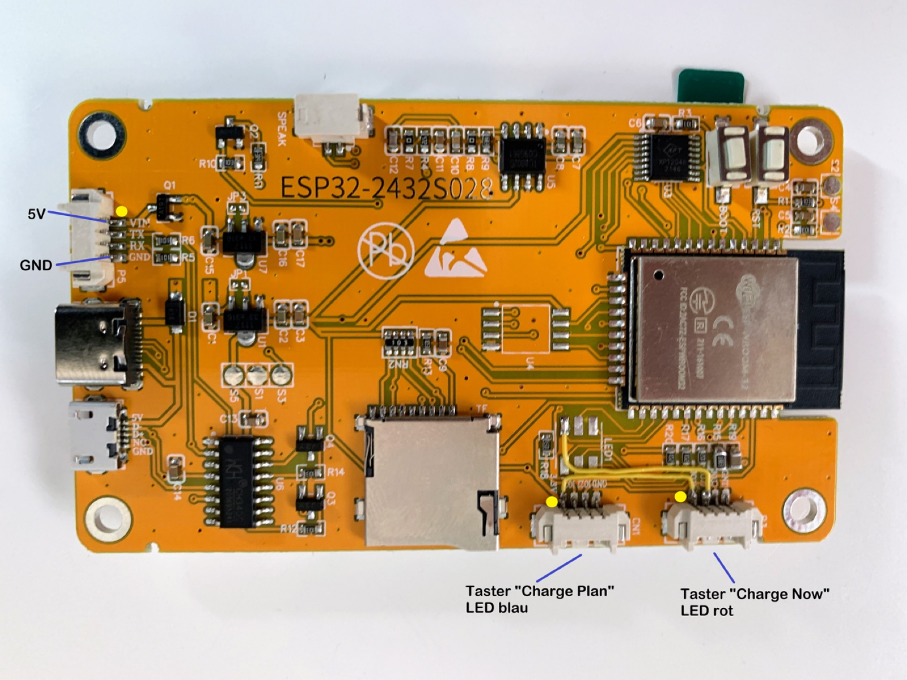

Links am Board die Speisung über `P5`, unten rechts die beiden vierpoligen
Stecker für die Taster.

---

## 2. Speisung

Über den vierpoligen Stecker `P5`. Die mittleren beiden Pins (TX und RX) bleiben
frei.

| Pin | Signal | Verwendung |
| :---: | :--- | :--- |
| 1 | `VIN` | +5 V |
| 2 | `TX` | — |
| 3 | `RX` | — |
| 4 | `GND` | Masse |

Das Gerät hängt dauerhaft am Netzteil; `power_save_mode: none` in der YAML setzt
das voraus.

---

## 3. Taster

Zwei beleuchtete Metalltaster, 19 mm, mit Ringbeleuchtung. Beide sind
Schliesser; die LED ist von der Tasterfunktion unabhängig und wird von der
Firmware getrennt angesteuert.

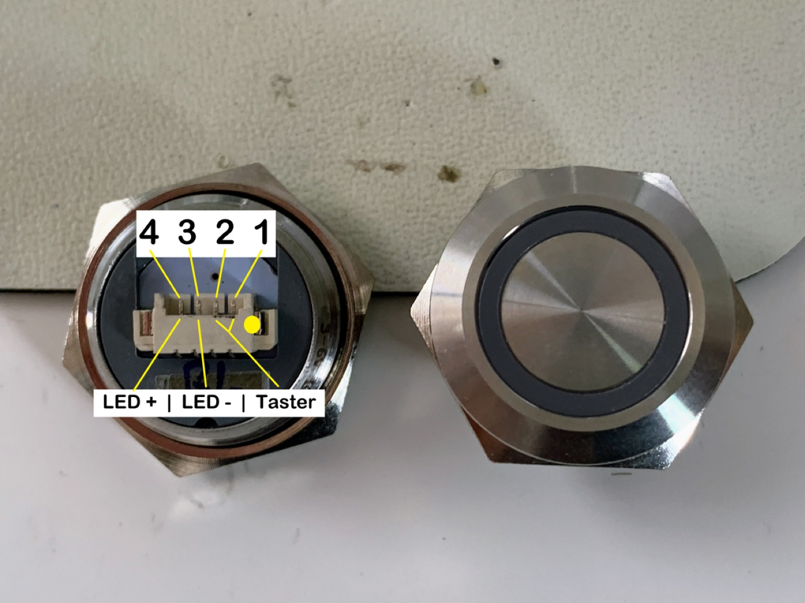

| Pin am Taster | Funktion |
| :---: | :--- |
| 1 | Taster |
| 2 | Taster, Masse |
| 3 | LED, Kathode |
| 4 | LED, Anode |

### Kabelbelegung

Das Kabel zwischen Taster und Board ist **gekreuzt** — Pin 1 des Tasters geht
auf Pin 4 des Boardsteckers und umgekehrt:

| Pin Taster | Pin am CYD | Signal |
| :---: | :---: | :--- |
| 1 | 3 | Taster |
| 2 | 4 | Masse |
| 3 | 2 | LED, Kathode |
| 4 | 1 | LED, Anode (+3.3 V) |

**Daraus folgt die invertierte Ansteuerung:** Die LED-Anode hängt fest an
3.3 V, geschaltet wird die Kathode über den GPIO. Der Ausgang muss also auf
*low* gehen, damit die LED leuchtet — genau deshalb tragen `led_now` und
`led_plan` in der YAML `inverted: true`.

### Belegung am Board

Die beiden Taster hängen an je einem der vierpoligen Stecker:

| Pin am CYD | `CN1` — «Charge Plan» | `P3` — «Charge Now» |
| :---: | :--- | :--- |
| 1 | +3.3 V | +3.3 V |
| 2 | `GPIO27` — LED blau | `GPIO17` — LED rot |
| 3 | `GPIO22` — Taster | `GPIO35` — Taster |
| 4 | `GND` | `GND` |

Die Zählung folgt hier dem Kabel, nicht dem Siebdruck — auf dem Board sind die
Pins in umgekehrter Reihenfolge beschriftet (siehe Abschnitt 4.3).

---

## 4. Die drei Modifikationen

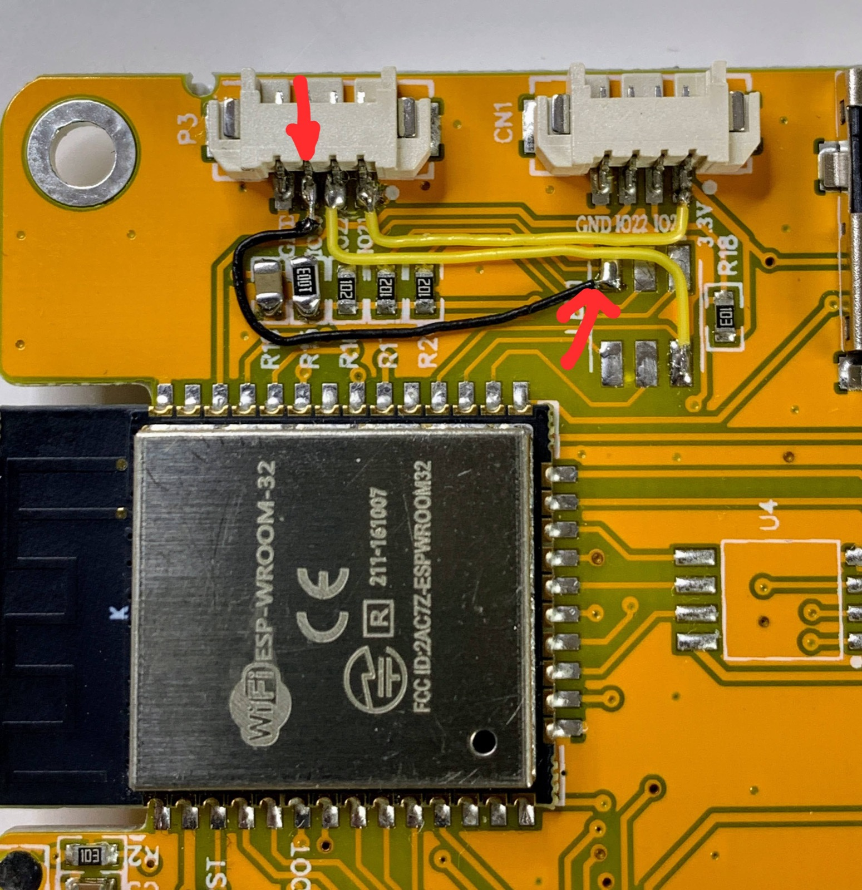

### 4.1 LDR-Mod

Erweitert den nutzbaren Bereich des Helligkeitssensors und glättet die Kennlinie.

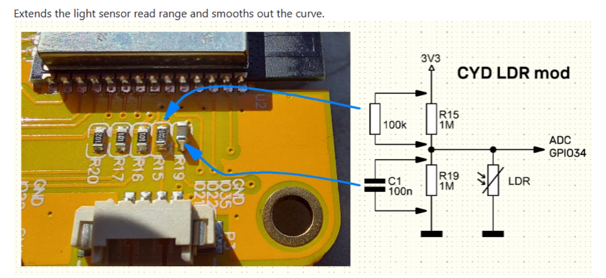

Der LDR bildet mit `R15` und `R19` (je 1 MΩ) einen Spannungsteiler auf den ADC
an `GPIO34`. Ergänzt werden zwei Bauteile:

| Bauteil | Wert | Platzierung |
| :--- | :--- | :--- |
| Widerstand | 100 kΩ | parallel zu `R15` |
| Kondensator | 100 nF | parallel zu `R19` |

Der Widerstand verschiebt den Arbeitspunkt, der Kondensator dämpft das Rauschen
des hochohmigen Teilers.

### 4.2 RGB-LED entfernen

`GPIO17` treibt auf dem unveränderten Board eine der drei Farben der
Onboard-RGB-LED. Da der Pin für die rote Taster-LED gebraucht wird, muss `LED1`
herunter — sonst leuchtet sie parallel mit und belastet den Ausgang.

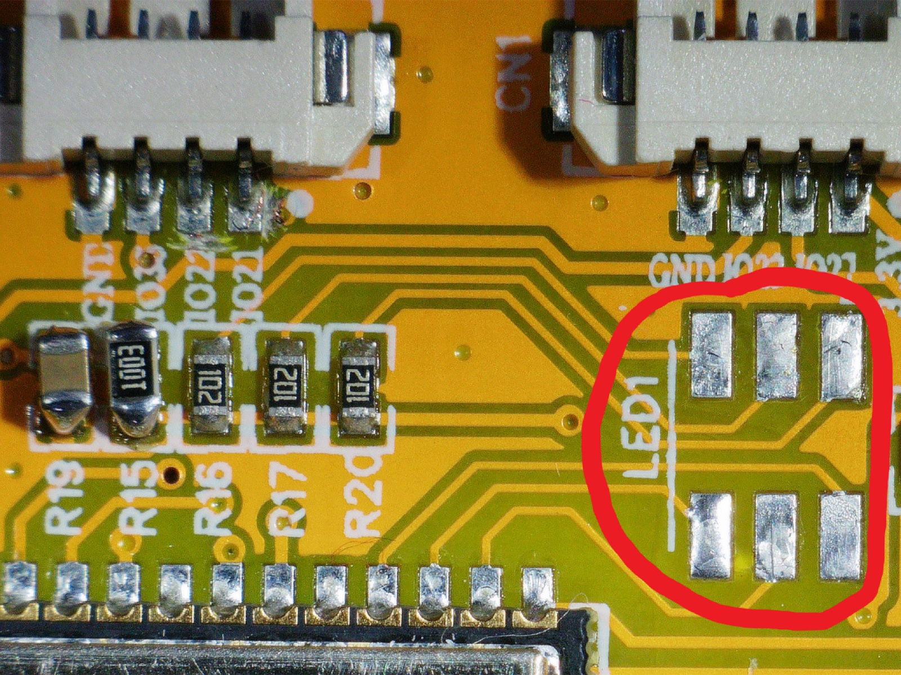

Von den freigelegten Pads wird anschliessend die Verbindung zum Taster-Stecker
abgegriffen.

### 4.3 P3 auftrennen und neu verdrahten

Am unveränderten Board sind die beiden Stecker so belegt:

| | Pin 1 | Pin 2 | Pin 3 | Pin 4 |
| :--- | :--- | :--- | :--- | :--- |
| `P3` (links) | `GND` | `IO35` | `IO22` | `IO21` |
| `CN1` (rechts) | `GND` | `IO22` | `IO21` | `3.3V` |

Beide führen also `IO22` und `IO21` parallel, und `IO21` ist zusätzlich die
Hintergrundbeleuchtung des Displays. An `P3` werden diese zwei Leiterbahnen
aufgetrennt — ihre Pins werden dort anders gebraucht:

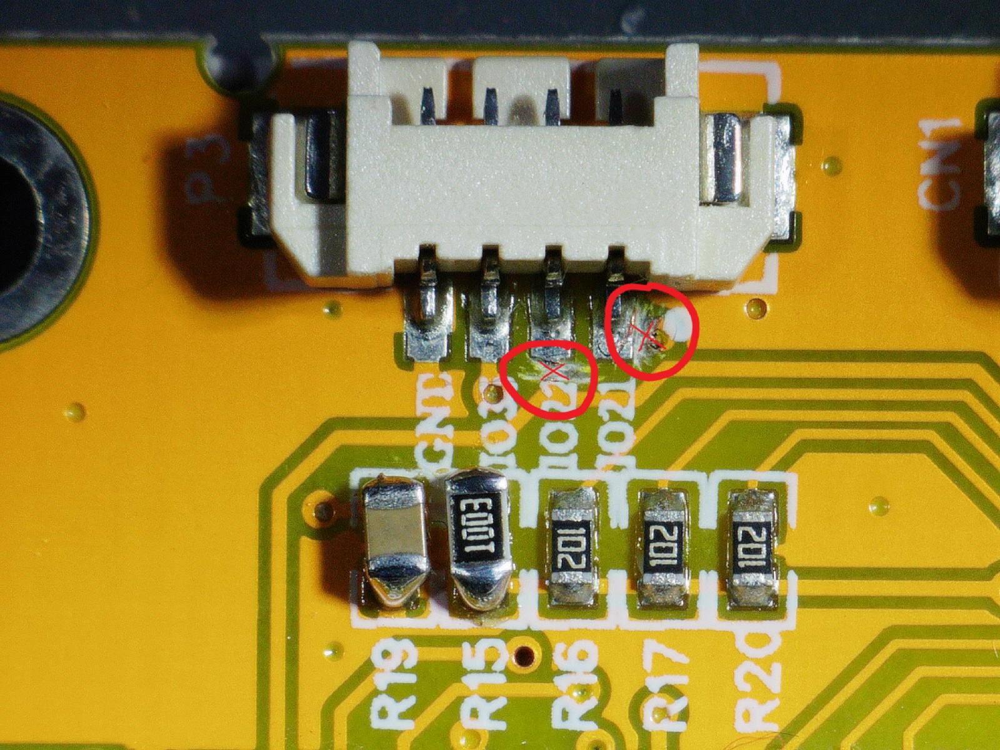

Danach bekommt `P3` seine neue Belegung. Sie macht den Stecker zum Anschluss für
den Taster **«Charge Now»**:

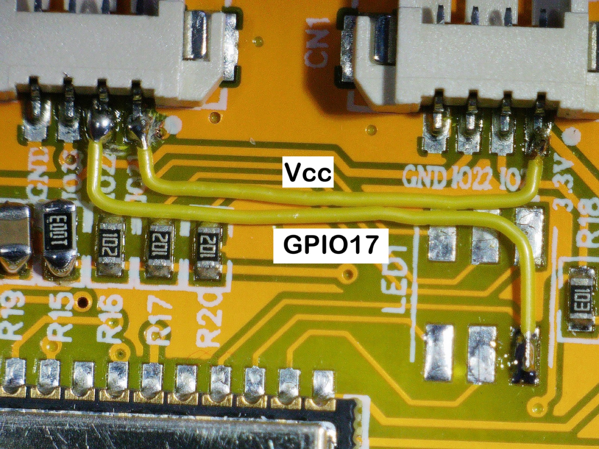

| Pin | vorher | nachher |
| :---: | :--- | :--- |
| 1 | `GND` | `GND` — unverändert |
| 2 | `IO35` | `GPIO35` — unverändert, Taster |
| 3 | `IO22` | **`GPIO17`** — Draht vom Pad der entfernten `LED1`, LED rot |
| 4 | `IO21` | **`Vcc`** — Draht von +3.3 V |

Im Bild beschriftet: der obere gelbe Draht führt +3.3 V auf Pin 4, der untere
`GPIO17` vom `LED1`-Pad auf Pin 3. `IO35` bleibt unberührt — der einzige der
vier Pins, der schon ab Werk das richtige Signal führt.

`CN1` behält seine Pins 1, 2 und 4 (`GND`, `IO22`, `3.3V`) und trägt damit den
Taster **«Charge Plan»** an `GPIO22`. Für dessen blaue LED an `GPIO27` ist ein
weiterer Draht nötig, denn `GPIO27` liegt ab Werk auf keinem der beiden Stecker
— im Übersichtsfoto in Abschnitt 4 der dritte, schwarze Draht.

---

## 5. Kein Pull-up an GPIO35

`GPIO35` ist beim ESP32 ein reiner Eingang **ohne** internen Pull-up, und auf dem
CYD ist ebenfalls keiner bestückt. Der Taster an diesem Pin braucht deshalb einen
**externen Pull-Widerstand**.

Der zweite Taster an `GPIO22` kommt ohne aus — dort schaltet die YAML den
internen Pull-up ein:

```yaml
pin:
  number: GPIO22
  mode:
    input: True
    pullup: True
```

Beide Eingänge haben zusätzlich `delayed_on: 10ms` als Entprellung.

---

## 6. Abgleich mit der Firmware

Aus der Geräte-YAML, Stand V1.1.0:

| Signal | GPIO | ID in der YAML | Besonderheit |
| :--- | :---: | :--- | :--- |
| Taster «Charge Now» | `GPIO35` | `button_charge_now` | `P3`, externer Pull-up nötig |
| Taster «Charge Plan» | `GPIO22` | `button_charge_plan` | `CN1`, interner Pull-up aktiv |
| LED rot, «Charge Now» | `GPIO17` | `led_now` | `P3`, LEDC, `inverted: true` |
| LED blau, «Charge Plan» | `GPIO27` | `led_plan` | `CN1`, LEDC, `inverted: true` |
| Hintergrundbeleuchtung | `GPIO21` | `backlight_pwm` | LEDC |
| LDR Raumhelligkeit | `GPIO34` | ADC | siehe LDR-Mod |

Zum Wiedererkennen am Board: `P3` ist der Stecker mit `IO35` im Siebdruck.

Auf dem Übersichtsfoto in Abschnitt 1 sind die beiden Stecker gegenüber den
Detailaufnahmen gedreht abgebildet. Im Zweifel gilt der Siebdruck.

---

## 7. Gehäuse

Wandgehäuse aus dem 3D-Drucker, zweiteilig: eine Schale, die Board, Netzteil und
Verkabelung aufnimmt, und eine aufgesetzte Frontblende mit dem Displayausschnitt
und den zwei Bohrungen für die Taster.

| | |
| :--- | :--- |
| 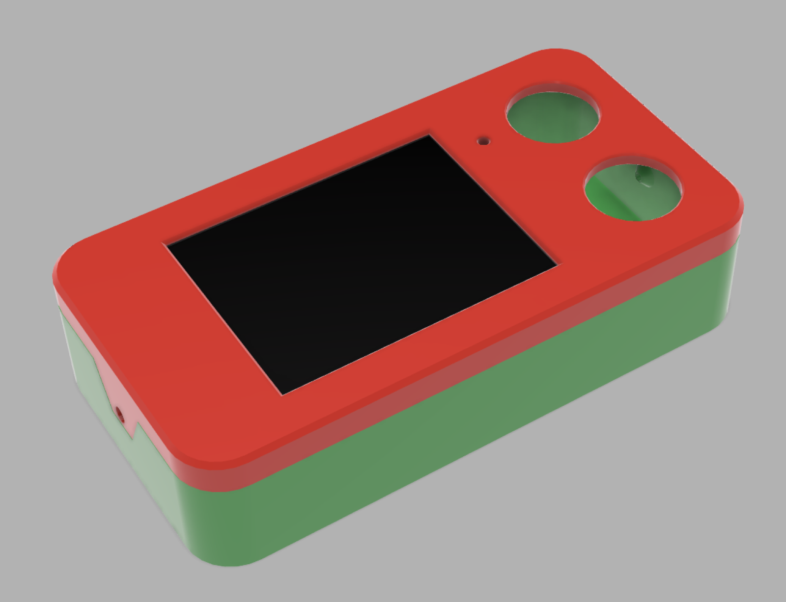 | 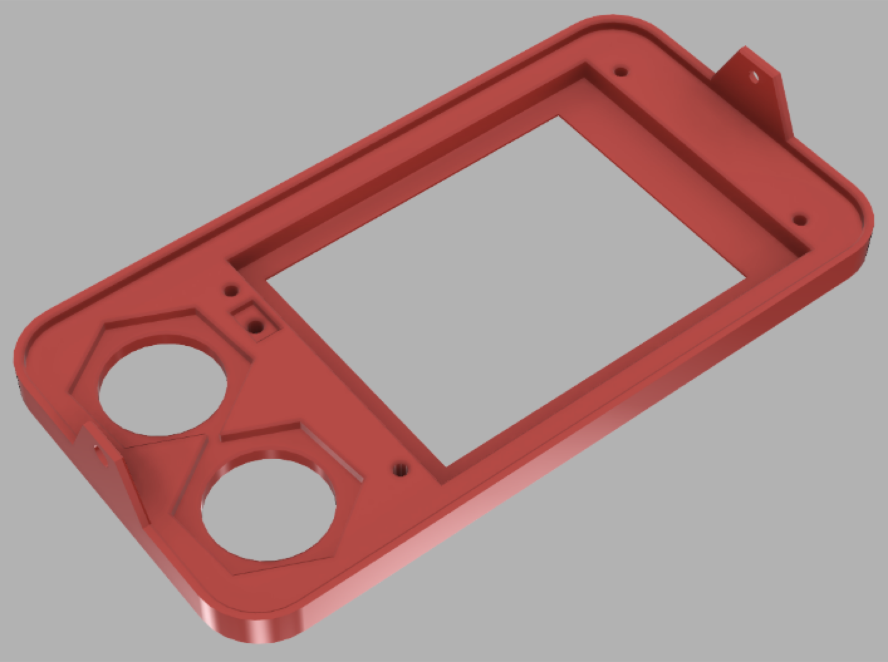 |

Die Schale trägt innen die Aufnahmen für das Board und einen Kanal für die
Netzzuleitung:

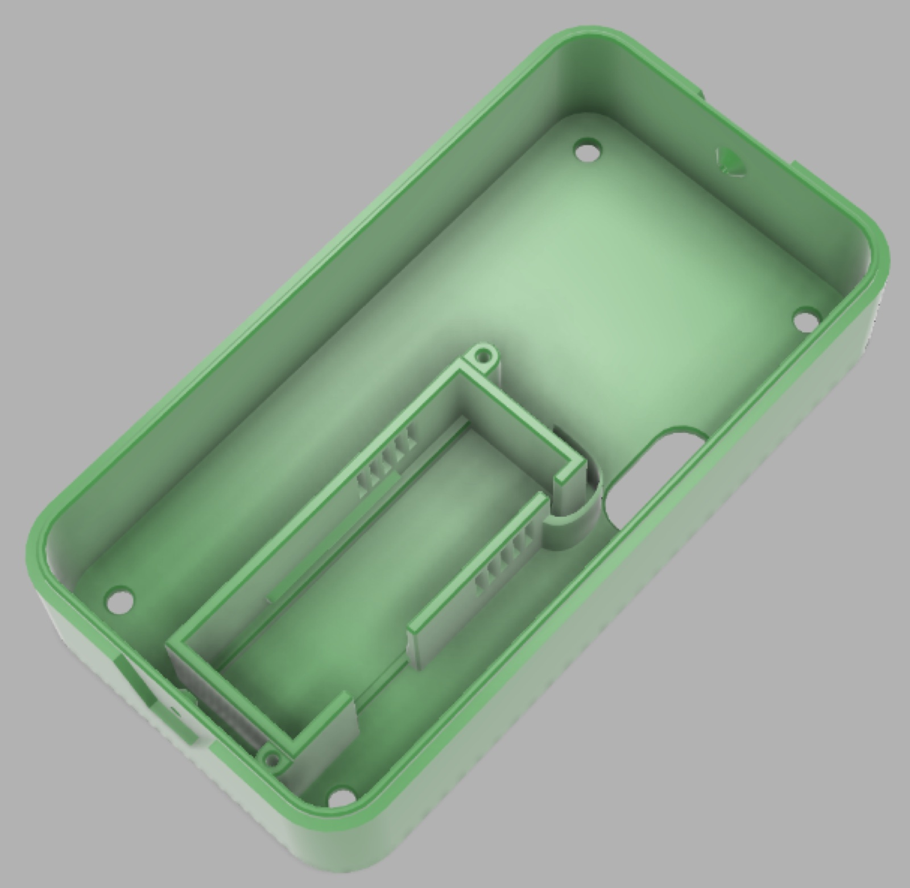

### Aufbau

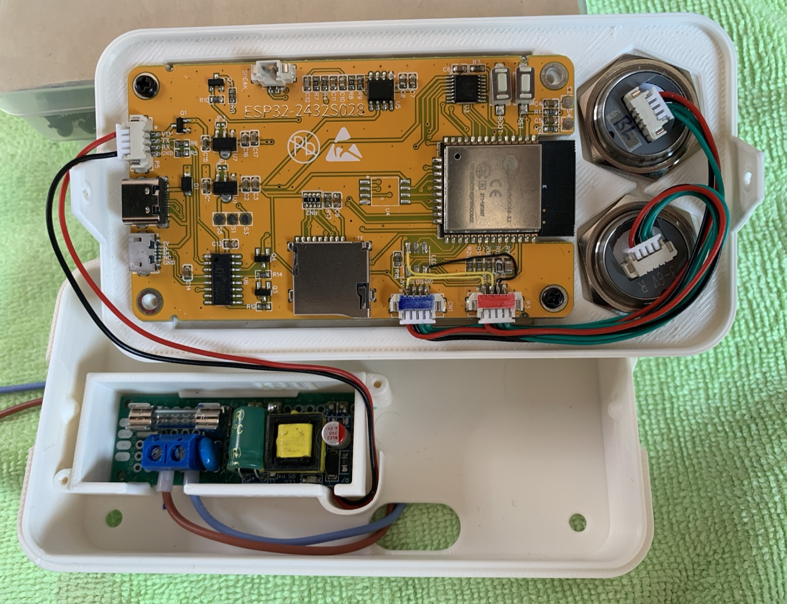

Links im Bild das Netzteil, rechts das CYD mit den beiden Tastern. Die Taster
sind 19-mm-Metalltaster mit Ringbeleuchtung und werden von vorne durch die
Blende gesteckt.

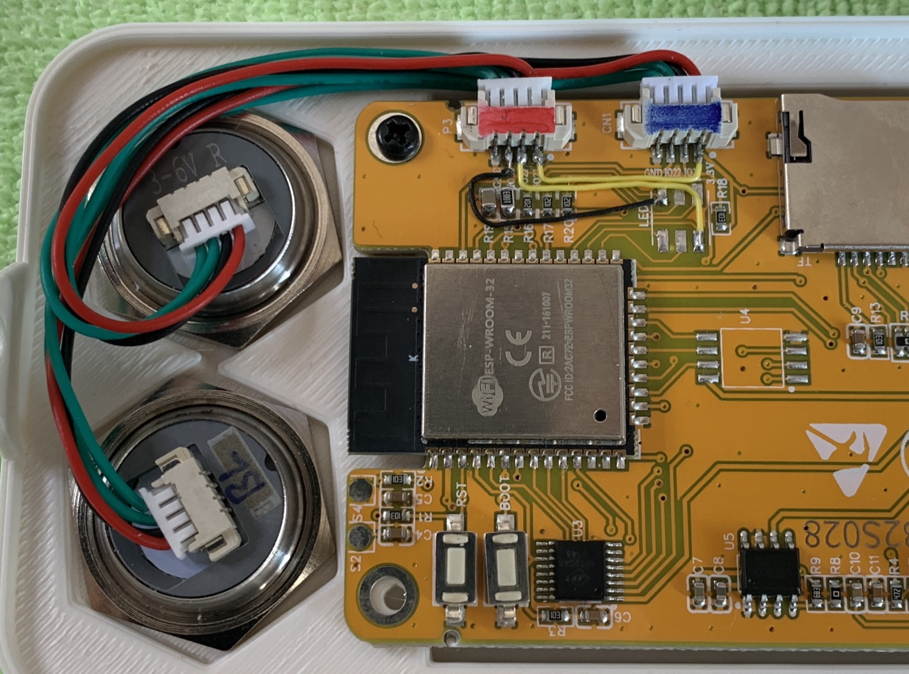

### Dateien

| Datei | Format | Zweck |
| :--- | :--- | :--- |
| [`3D/info-display-case-v6.f3z`](3D/info-display-case-v6.f3z) | Fusion-Archiv | zum Weiterbearbeiten |
| [`3D/info-display-case-v6.step`](3D/info-display-case-v6.step) | STEP AP214 | für andere CAD-Programme |

Der STEP-Export trägt im Dateikopf noch die Bezeichnung `Info Display Case
v5.step` und ist auf den 2024-05-10 datiert — die Geometrie entspricht dem
Stand, der im Gerät verbaut ist.

### Das fertige Gerät

An der Wand montiert, mit dem Symbolsatz ab V1.1.0.

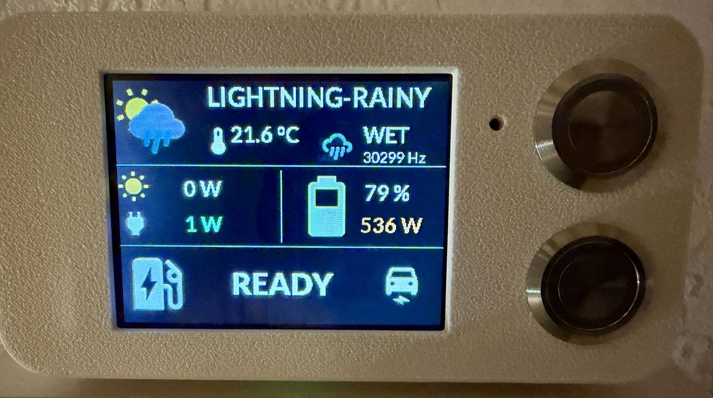

Die Übersicht zeigt Wetterlage, Aussentemperatur und den Regensensor mit seiner
Rohfrequenz, darunter PV-Ertrag und Netzbezug links, Ladezustand und Leistung
der Hausbatterie rechts, unten der Zustand der Wallbox.

Gut zu sehen ist hier auch ein bekannter Punkt: Das Wettersymbol links zeigt
Sonne hinter einer Regenwolke, während daneben `LIGHTNING-RAINY` steht. Die
Animation ist reine Dekoration und folgt der gemeldeten Wetterlage nicht — siehe
Abschnitt 8 der [README](README.md).

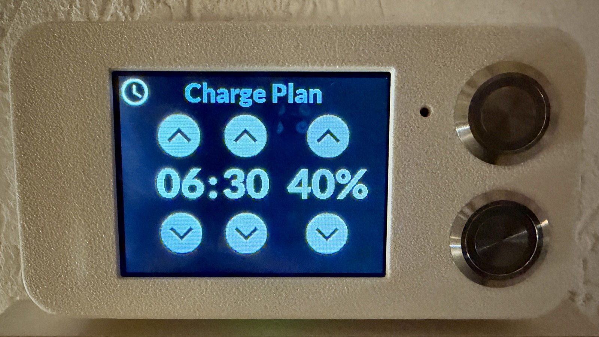

Die Eingabeseite für den Ladeplan: oben und unten je drei Flächen zum Verstellen
von Uhrzeit und Ziel-Ladestand. Die Beschreibung aller fünf Seiten steht in
Abschnitt 3 der [README](README.md).
