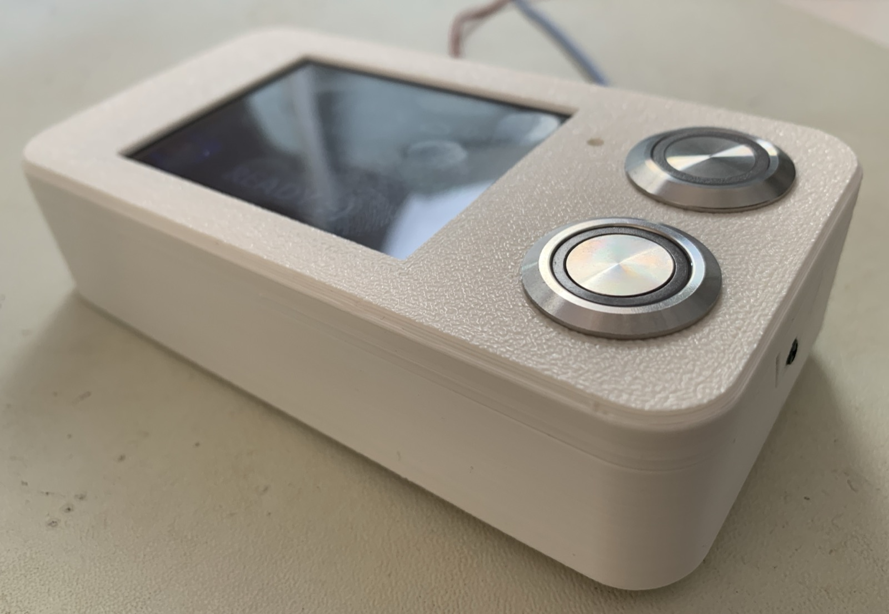

# ha-frontroom-info-display - Touch-Infodisplay für PV, Hausbatterie und Wallbox


[](https://esphome.io/)
[](https://opensource.org/licenses/MIT)

Ein wandmontiertes 2.8"-Touchdisplay im Vorzimmer, das die wichtigsten Werte des
Hauses ohne Handy und ohne App zeigt: Wetter, PV-Erzeugung, Netzbezug bzw.
-einspeisung, Hausbatterie, Wärmepumpe und den Zustand der Wallbox. Über den
Touchscreen und zwei Hardware-Taster lässt sich der Lademodus des Autos direkt
umschalten und ein Ladeplan setzen - die Anfragen gehen per REST an evcc, nicht
über eine Home-Assistant-Automation.



Gehäuse, Aufbau und die nötigen Umbauten am Board stehen in
[HARDWARE.md](HARDWARE.md), das 3D-Modell liegt unter [`3D/`](3D/).

---

## Haftungsausschluss (Disclaimer)

⚠️ **WICHTIGER HINWEIS: VERWENDUNG AUF EIGENE GEFAHR!** ⚠️

Dieses Projekt beschreibt ein privates Bastelprojekt zur Optimierung der eigenen
Hausautomatisierung. Die Nutzung, der Nachbau sowie das Einspielen des
bereitgestellten Codes und der Konfigurationen erfolgen ausdrücklich auf
**eigene Gefahr und eigenes Risiko**.

Der Autor übernimmt **keinerlei Haftung, Gewährleistung oder Verantwortung**
für:

* **Schäden jeglicher Art** an Display, Elektronik oder anderen Komponenten der
  Haustechnik.
* **Folgeschäden durch Fehlbedienung der Wallbox:** Das Display schreibt
  ungefragt und unauthentifiziert in die evcc-API. Ein Fehlgriff auf dem
  Touchscreen, ein prellender Taster oder ein fehlerhaft berechneter
  Ladeplan-Zeitstempel können eine Ladung starten, verhindern oder verschieben -
  mit entsprechenden Stromkosten oder einem morgens nicht geladenen Auto.
* Die Richtigkeit der **angezeigten Werte**. Die Anzeige ist eine
  Wiedergabe fremder Sensoren, teils mit selbst gerechneten Restgrössen. Sie ist
  keine Messeinrichtung und für keinerlei Abrechnung geeignet.
* Die Richtigkeit, Aktualität oder Vollständigkeit des bereitgestellten Codes
  oder der Dokumentation.

Mit der Verwendung dieses Codes oder Nachbau der Hardware erklärst du dich damit
einverstanden, auf jegliche Schadensersatzansprüche gegenüber dem Autor zu
verzichten.

---

## 1. Funktionsprinzip

* **Reines Anzeige- und Bediengerät.** Das Display erfasst selbst nur die
  Raumhelligkeit und die beiden Tasterzustände. Alle dargestellten Messwerte
  kommen als `homeassistant`-Sensoren aus Home Assistant herein; das Gerät ist
  ohne HA-Verbindung dunkel bis auf die Diagnose.
* **Fünf Seiten, eine Startseite.** Die Übersicht (`main_page`) ist der
  Ruhezustand. Von dort führen drei Berührungsflächen in Detailseiten, eine
  Rückkehrfläche oben rechts führt zurück. Nach zwei Minuten ohne Berührung
  fällt die Anzeige selbständig auf die Übersicht zurück.
* **Schreibender Zugriff nur auf evcc.** Lademodus und Ladeplan werden per HTTP
  direkt an die evcc-REST-API geschickt. Home Assistant ist an diesem Pfad
  nicht beteiligt und erfährt die Änderung erst über die evcc-Integration.
* **Drei Wege zum Lademodus.** Hardware-Taster «Schnellladen» mit Status-LED,
  Template-Schalter in Home Assistant und die drei Flächen auf `ev_page` lösen
  dieselben Skripte aus. Die Taster und der HA-Schalter kennen nur `NOW` und
  `PV`, die Touchflächen zusätzlich `OFF` — und sie sind nur wirksam, wenn ein
  Fahrzeug angesteckt ist. Der **Ladeplan** hat zwei Wege: Hardware-Taster
  «Ladeplan» und Template-Schalter. Beide öffnen die Eingabeseite nur, wenn
  evcc ein angestecktes Fahrzeug meldet; **löschen** lässt sich ein Plan immer.
* **Das Gerät zeigt, was evcc meldet.** Die beiden Tasten-LEDs werden nicht
  lokal geschaltet, sondern im Sekundentakt gegen `${ent_plan_enabled}` und
  `${ent_evcc_mode}` abgeglichen. Ein lokaler Eingriff kann damit nicht stehen
  bleiben, und eine verpasste Meldung heilt von selbst.
* **Lokale Helligkeitsregelung.** Ein LDR am ADC steuert die
  Hintergrundbeleuchtung in zwei Stufen, unabhängig von Home Assistant.

---

## 2. Hardware & Pinout (ESP32-2432S028R)

Das Projekt läuft auf einem ESP32-2432S028R (verbreitet als «Cheap Yellow
Display») unter dem ESP-IDF-Framework, `board: esp32dev`, mit
`minimum_chip_revision: "3.1"`.

> **Das Board muss umgebaut werden.** Zwei der vier Signale für die Taster
> liegen am unveränderten CYD nicht auf einem Stecker. Die nötigen Eingriffe —
> LDR-Mod, Entfernen der RGB-LED, Auftrennen und Neuverdrahten des
> Tasteranschlusses — samt Speisung, Kabelbelegung und Fotos stehen in
> [HARDWARE.md](HARDWARE.md).

Die Baugruppe nutzt **zwei getrennte SPI-Busse** - Display und Touchcontroller
teilen sich auf diesem Board keinen Bus:

| Bus | CLK | MOSI | MISO |
| :--- | :---: | :---: | :---: |
| `tft` (Display) | `GPIO14` | `GPIO13` | `GPIO12` |
| `touch` (XPT2046) | `GPIO25` | `GPIO32` | `GPIO39` |

| Peripherie / Funktion | GPIO | Beschreibung / Besonderheit |
| :--- | :---: | :--- |
| **Display CS** | `GPIO15` | `ili9xxx`, Modell `ili9342`, 320 × 240 |
| **Display DC** | `GPIO2` | `color_order: rgb`, `invert_colors: false` |
| **Hintergrundbeleuchtung** | `GPIO21` | LEDC-PWM, als `monochromatic`-Light |
| **Touch CS** | `GPIO33` | `xpt2046`, `threshold: 400`, 50 ms Abtastung |
| **Touch IRQ** | `GPIO36` | Interrupt-Pin des Touchcontrollers |
| **LDR Raumhelligkeit** | `GPIO34` | ADC, Rohwert, 2 s, `internal: true` |
| **Taster «Schnellladen»** | `GPIO35` | `delayed_on: 10ms`, Input-only-Pin |
| **Taster «Ladeplan»** | `GPIO22` | `delayed_on: 10ms`, interner Pull-Up |
| **LED «Charge Now»** | `GPIO17` | LEDC, **invertiert** |
| **LED «Charge Plan»** | `GPIO27` | LEDC, **invertiert** |

**Touch-Kalibrierung:** sieben Werte im Substitutionsblock. Wie man sie für ein
anderes Panel ermittelt, steht in [HARDWARE.md](HARDWARE.md), Abschnitt 8.

**Hinweis zu GPIO35:** Der Pin ist beim ESP32 reiner Eingang ohne internen
Pull-Up. Der Taster «Schnellladen» braucht daher einen externen Pull-Widerstand
auf der Platine - anders als der Taster an GPIO22, der den internen Pull-Up
nutzt.

**Anzeige:** Das Panel wird über die Modellvorgabe im Landscape-Format mit
320 × 240 betrieben. `color_palette: 8BIT` hält den Framebuffer klein, kostet
aber Farbabstufungen - sichtbar an Verläufen im Wetter-GIF. Die Seite wird alle
500 ms neu gezeichnet.

---

## 3. Display-Seiten & Bedienung

### `main_page` - Übersicht (Ruhezustand)

Vier Zonen, durch Linien in HA-Blau getrennt:

* **Oben:** animiertes Wetter-GIF, Wetterlage als Text, Aussentemperatur, und
  der Zustand des Regensensors (`WET` mit Sensorfrequenz oder `DRY`). Ohne
  gültigen Regenwert steht dort `---`.
* **Mitte links:** PV-Erzeugung und Netzleistung. Netzeinspeisung wird grün,
  Netzbezug rot dargestellt.
* **Mitte rechts:** Hausbatterie mit SoC-abhängigem Symbol (fünf Stufen in
  20-%-Schritten), SoC in Prozent und Lade-/Entladeleistung, wieder grün für
  Laden und rot für Entladen.
* **Unten:** Wallbox. `CHARGING` mit Leistung, SoC und Reichweite; `DONE`, wenn
  der Ziel-SoC erreicht ist; `READY` bei angestecktem, nicht ladendem Auto -
  mit Ladeplan-Angabe, falls ein Plan aktiv ist. Ist nichts angesteckt, steht
  `nothing connected` samt Solaranteil der letzten 30 Tage. Seit V1.4.0 steht
  dabei, welches Fahrzeug evcc meldet — weiss beim bekannten, orange bei einem
  fremden. Beim bekannten Fahrzeug im Zustand `READY` ohne Ladeplan mittig
  über dem Fahrzeugsymbol rechts, sonst klein rechtsbündig in der freien Zeile
  darüber — der Text der übrigen Zustände füllt den Streifen bis nach rechts,
  und «Guest vehicle» wäre mittig über dem Symbol zu breit.

### Berührungsflächen der Übersicht

| Zone (x / y) | Ziel |
| :--- | :--- |
| `0…320` / `160…240` | `ev_page` |
| `0…160` / `80…160` | `energy_page` |
| `160…320` / `80…160` | `bat_page` |
| `280…320` / `0…40` | `main_page` — nur auf `ev_page`, `bat_page` und `energy_page`, wo das Zurück-Symbol gezeichnet wird |

> **Grundsatz:** Eine Berührungsfläche ist nur dann aktiv, wenn das zugehörige
> Bedienelement in diesem Moment auch dargestellt wird. Wo die Seitenbindung
> über `page_id` dafür nicht ausreicht, steht die Bedingung als `if` in der
> `on_press`-Automatisierung.

### `ev_page` - Wallbox-Detail

Kopfzeile je nach Zustand `Charging`, `Charge done` oder `Charger ready`,
darunter das Fahrzeug: beim bekannten der Titel aus evcc in Weiss, bei einem
fremden dessen Titel in Orange, sonst `Guest vehicle`. Solange evcc erkennt oder
die Home-Assistant-Automation prüft, steht dort `Detecting vehicle …`
beziehungsweise `Checking vehicle …` — ein leerer Titel hiesse in dieser Phase
sonst fälschlich Gastfahrzeug.

**Der SoC-Balken wechselt die Höhe.** Wird geladen, braucht der Leistungsbalken
seinen Platz knapp über den Modusflächen, und der SoC-Balken sitzt darüber auf
y=96. Ohne Ladung entfällt der Leistungsbalken, und der SoC-Balken rückt auf
dessen Platz bei y=140 — sonst klaffte unten eine leere Fläche.
`Charge done` erscheint nur, wenn Ladestand **und** Ziel-SoC bekannt sind: evcc
meldet einen unbekannten Ladestand als 0, und ein schlafendes Fahrzeug würde
sonst als fertig geladen gelten. Darunter
ein SoC-Balken mit Skala 0…100 % sowie - nur während des Ladens - ein
Leistungsbalken mit Skala 0…11 kW. Unten drei Flächen zur Modusumschaltung, der
aktive Modus ist gefüllt dargestellt:

| Fläche (x / y) | Aktion |
| :--- | :--- |
| `60…116` / `180…236` | Modus `OFF` |
| `132…188` / `180…236` | Modus `PV` |
| `204…260` / `180…236` | Modus `NOW` |

Ein aktiver Ladeplan wird links unten mit Uhrzeit und Ziel-SoC eingeblendet. Ist
nichts angesteckt, zeigt die Seite nur `Nothing connected to wallbox` — die drei
Modusflächen sind dann **inaktiv**, ebenso solange noch keine Meldung zum
Anschlusszustand vorliegt.

**Touch-Sperre:** Der Sprung von der Übersicht auf `ev_page` erfolgt über eine
Fläche, die den Modusflächen der Zielseite räumlich überlappt. Damit dieselbe
Berührung nicht sofort einen Modus umschaltet, setzt die Eintrittsfläche
`touch_lock` und gibt ihn erst im `on_release` wieder frei. Die drei
Modusflächen prüfen dieses Flag.

### `plan_setup_page` - Ladeplan setzen

Drei Wertepaare mit Auf-/Ab-Flächen, jeweils als gedrückt/ungedrückt gezeichnete
Bilder von 60 × 60 px. Die Flächen liegen deckungsgleich darauf:

| Fläche (x / y) | Wert |
| :--- | :--- |
| `40…100` / `40…100` bzw. `160…220` | Stunde, auf / ab |
| `120…180` / `40…100` bzw. `160…220` | Minute, auf / ab |
| `220…280` / `40…100` bzw. `160…220` | Ziel-SoC, auf / ab |

| Wert | Schrittweite | Umlauf / Grenzen |
| :--- | :---: | :--- |
| Stunde | 1 | 0…23, umlaufend |
| Minute | 10 | 0…50, umlaufend |
| Ziel-SoC | 5 | 0…100 %, geklemmt |

Alle drei Werte sind neustartfest (`restore_value: yes`, Vorgaben 03:30 / 65 %).
Jede Berührung setzt einen **10-Sekunden-Timer** zurück. Läuft er ab, wird der
Plan an evcc gesendet und die Anzeige springt auf die Übersicht - es gibt keine
gesonderte Bestätigungsfläche und kein Abbrechen. Die Seite lässt sich nur über
den Taster an GPIO22 oder den HA-Schalter «EVCC Planladung» öffnen, nicht per
Touch von der Übersicht aus.

**Der Ladeplan gilt nur für das bekannte Fahrzeug.** Seite, Schalter und
Senderoutine prüfen seit V1.4.0, dass evcc genau `evcc_vehicle` als
zugeordnetes Fahrzeug meldet. Der Plan wird auf diese Fahrzeug-ID geschrieben —
bei einem fremden Auto an der Wallbox landete er sonst beim eigenen. Das
Löschen eines bestehenden Plans bleibt jederzeit möglich. Alle anderen
Funktionen, insbesondere die drei Lademodi, stehen auch einem Gastfahrzeug
offen.

### `bat_page` - Hausbatterie

SoC und aktuelle Lade-/Entladeleistung als Zahlenwerte, darunter ein
`graph`-Element mit dem SoC-Verlauf der letzten 24 Stunden (Raster 2 h / 20 %,
300 × 100 px). Der Verlauf wird im RAM gehalten und ist nach einem Reboot leer.

### `energy_page` - Energieflussbild

Symbolische Darstellung von Netz, PV, Hausbatterie, Wallbox, Wärmepumpe,
Heizstab und Haus, verbunden durch **animierte Richtungspfeile**, deren Richtung
sich nach dem Vorzeichen der jeweiligen Leistung richtet. Der Zähler `arr_anim`
läuft bei jedem Seitenaufbau von 0 bis 5 und verschiebt die Pfeile um jeweils
vier Pixel.

Die Hausleistung ist **keine gemessene Grösse**, sondern die Restgrösse der
Bilanz:

```
P_ein   = PV + Netzbezug + Batterieentladung
P_Haus  = P_ein − Netzeinspeisung − Batterieladung − Wallbox − Heizstab − Wärmepumpe
```

Messfehler und nicht erfasste Verbraucher landen damit vollständig im Wert für
das Haus, der dadurch auch negativ werden kann.

---

## 4. evcc-Anbindung

Alle schreibenden Aufrufe gehen per `http_request` an `${evcc_url}`. Fünf
Skripte decken die Funktionen ab:

| Skript | Aufruf |
| :--- | :--- |
| `set_mode_now` | `POST /api/loadpoints/${evcc_loadpoint}/mode/now` |
| `set_mode_pv` | `POST /api/loadpoints/${evcc_loadpoint}/mode/pv` |
| `set_mode_off` | `POST /api/loadpoints/${evcc_loadpoint}/mode/off` |
| `send_plan_request` | `POST /api/vehicles/${evcc_vehicle}/plan/soc/<soc>/<zeitstempel>` |
| `delete_plan_request` | `DELETE /api/vehicles/${evcc_vehicle}/plan/soc` |

**Zeitstempel des Ladeplans:** Aus Stunde, Minute und der aktuellen Zeit von
Home Assistant wird im Lambda ein ISO-8601-Zeitstempel in UTC gebildet. Liegt
die eingestellte Uhrzeit noch in der Zukunft, gilt sie für heute, sonst für
morgen. Die Rechnung geht über `now().timestamp` (UTC) abzüglich der
Ortszeit-Sekunden seit Mitternacht und macht damit keine Annahme über die
Zeitzone; fällt eine Zeitumstellung dazwischen, korrigiert ein Gegencheck mit
`ESPTime::from_epoch_local()` die Stunde.

Voraussetzung ist ein gesetztes `timezone:` — siehe `device_timezone` in
Abschnitt 6.

**Kein Plan ohne gemeldetes Fahrzeug:** `send_plan_request` wird nur
ausgeführt, wenn `${ent_evcc_connected}` ein angestecktes Fahrzeug meldet — evcc
könnte einen Plan sonst keinem Fahrzeug zuordnen. Das gilt auch für den
Zehn-Sekunden-Timer der Eingabeseite. `delete_plan_request` ist nicht
eingeschränkt.

**Keine Fehlerbehandlung:** Die Skripte werten die HTTP-Antwort nicht aus. Ist
evcc nicht erreichbar, bleibt die Anzeige unverändert und es gibt keinen
Hinweis; erst der nächste Zustandsbericht der evcc-Integration korrigiert das
Bild. `verify_ssl: false` ist gesetzt, ohne Bedeutung, da ohnehin nur `http://`
aufgerufen wird.

---

## 5. Home Assistant Integration

### Vom Gerät bereitgestellt

| Entität | Typ | Bedeutung |
| :--- | :--- | :--- |
| **Display Backlight** | `light` (monochromatic) | Helligkeit der Hintergrundbeleuchtung, `restore_mode: ALWAYS_ON` |
| **EVCC Schnellladen** | `switch` (template) | EIN spiegelt evcc-Modus `NOW`; Einschalten setzt `NOW`, Ausschalten `PV` |
| **EVCC Planladung** | `switch` (template) | EIN spiegelt einen aktiven Ladeplan; Einschalten öffnet die Eingabeseite am Display — nur bei angestecktem Fahrzeug —, Ausschalten löscht den Plan |
| **Touch Kalibrierlog** | `switch` (template, Kategorie *Konfiguration*) | Gibt bei jeder Berührung Bildschirm- und Rohkoordinaten ins Log aus. Für die Kalibrierung eines neuen Panels, siehe [HARDWARE.md](HARDWARE.md), Abschnitt 8. Nach einem Neustart immer aus |

Dazu die Diagnose-Entitäten der Kategorien 2.x bis 6.x aus
`common/diagnostics.yaml`. Die Heap-Grenzen sind für den ESP32 auf 80 kB (gut)
und 40 kB (kritisch) angehoben.

Nicht in Home Assistant sichtbar sind der LDR-Sensor «Room Brightness» und die
beiden Status-LEDs - sie sind als `internal: true` deklariert.

> **Achtung beim Schalter «EVCC Planladung»:** Einschalten *setzt keinen Plan*,
> sondern öffnet nur die Eingabeseite am Display und startet den
> 10-Sekunden-Timer. Wer den Schalter in HA einschaltet und nicht ans Display
> geht, sendet nach zehn Sekunden die zuletzt gespeicherten Werte. Ohne
> angestecktes Fahrzeug passiert gar nichts. Der Schalter fällt danach auf den
> tatsächlichen evcc-Zustand zurück.

### Vom Gerät konsumiert

Das Display abonniert 28 Entitäten aus Home Assistant. Seit V1.3.0 steht kein
Entitätsname mehr im Code — jeder hängt an einer Substitution am Kopf der YAML.
Die Vorgabewerte stehen in Abschnitt 6.

| Bereich | Substitutionen |
| :--- | :--- |
| PV & Netz | `ent_pv_power`, `ent_grid_power` |
| Hausbatterie | `ent_battery_soc`, `ent_battery_power` |
| Wetter | `ent_weather`, `ent_outdoor_temperature`, `ent_rain`, `ent_rain_frequency` |
| Fahrzeug | `ent_vehicle_soc`, `ent_vehicle_range`, `ent_vehicle_target_soc`, `ent_vehicle_name`, `ent_vehicle_title`, `ent_vehicle_detection` |
| Wallbox & evcc | `ent_evcc_mode`, `ent_evcc_connected`, `ent_evcc_charging`, `ent_evcc_charge_power`, `ent_evcc_charge_current`, `ent_evcc_solar_share_30d` |
| Ladeplan | `ent_plan_enabled`, `ent_plan_soc`, `ent_plan_time`, `ent_plan_automation` |
| Wärmepumpe & Heizstab | `ent_heatpump_power_electric`, `ent_heatpump_power_heat`, `ent_heater_power`, `ent_heater_percent` |

`ent_plan_automation` ist der einzige Eintrag, der kein Entitätsergebnis
abonniert, sondern das Attribut `current` der Home-Assistant-Automation
«Wallbox: Fahrzeug angesteckt». Es ist grösser als 0, solange die Automation
nach dem Anstecken auf die Fahrzeugbestätigung wartet und den Lademodus
deshalb auf `OFF` hält.

Ein `time`-Sensor der Plattform `homeassistant` liefert die Zeitbasis für den
Ladeplan. Ohne HA-Verbindung ist damit auch das Setzen eines Plans nicht
möglich.

---

## 6. Konfiguration, Assets & Inbetriebnahme

### Der Substitutionsblock

Alles, was in einer anderen Installation abweicht, steht am **Kopf der YAML**.
Darunter ist kein Entitätsname, keine Adresse und kein Anlagenwert mehr fest
verdrahtet.

**Gerät**

| Substitution | Vorgabe | Bedeutung |
| :--- | :--- | :--- |
| `device_name` | `ha-frontroom-info-display` | `name` und `friendly_name`, zugleich der mDNS-Name |
| `project_name` | `tsgwiro1.ha-frontroom-info-display` | `project:`-Block |
| `fw_version` | `1.3.1` | Firmwarestand, siehe Abschnitt «Versionierung» im Repo-`CLAUDE.md` |
| `device_timezone` | `Europe/Zurich` | IANA-Name oder POSIX-TZ-Zeichenkette. **Ohne Angabe nimmt ESPHome die Zeitzone des bauenden Rechners** — der Ladeplan ginge dann mit einer fremden Ortszeit an evcc |

**evcc**

| Substitution | Vorgabe | Bedeutung |
| :--- | :--- | :--- |
| `evcc_url` | `http://homeassistant.local:7070` | Basisadresse der evcc-REST-Schnittstelle |
| `evcc_loadpoint` | `1` | Nummer des Ladepunkts |
| `evcc_vehicle` | `db:1` | Fahrzeug-ID für den SoC-Ladeplan |

**Entitäten aus Home Assistant** — die Vorgaben sind die Namen der Anlage des
Autors und werden in jeder anderen Installation abweichen:

| Substitution | Vorgabe |
| :--- | :--- |
| `ent_pv_power` | `sensor.input_power` |
| `ent_grid_power` | `sensor.grid_active_power` |
| `ent_battery_soc` | `sensor.battery_state_of_capacity` |
| `ent_battery_power` | `sensor.charge_discharge_power` |
| `ent_heatpump_power_electric` | `sensor.total_wp` |
| `ent_heatpump_power_heat` | `sensor.wp_warmeleistung` |
| `ent_heater_power` | `sensor.heizstab` |
| `ent_heater_percent` | `sensor.wp_zwe2_controller_output_power` |
| `ent_weather` | `weather.egnach` |
| `ent_outdoor_temperature` | `sensor.outdoor_temperature` |
| `ent_rain` | `binary_sensor.raining` |
| `ent_rain_frequency` | `sensor.weather_station_frequency` |
| `ent_evcc_mode` | `select.evcc_mode` |
| `ent_evcc_connected` | `binary_sensor.evcc_loadpoint_connected` |
| `ent_evcc_charging` | `binary_sensor.evcc_loadpoint_charging` |
| `ent_evcc_charge_power` | `sensor.evcc_charge_power_w` |
| `ent_evcc_charge_current` | `sensor.evcc_charge_current` |
| `ent_evcc_solar_share_30d` | `sensor.evcc_charge_30d_solar_percentage` |
| `ent_vehicle_soc` | `sensor.evcc_vehicle_soc` |
| `ent_vehicle_range` | `sensor.evcc_vehicle_range` |
| `ent_vehicle_target_soc` | `sensor.evcc_vehicle_target_soc` |
| `ent_plan_enabled` | `binary_sensor.evcc_chargeplan_enabled` |
| `ent_plan_soc` | `sensor.evcc_chargeplan_soc` |
| `ent_plan_time` | `sensor.evcc_chargeplan_time` |
| `ent_vehicle_name` | `sensor.evcc_vehicle_name` |
| `ent_vehicle_title` | `sensor.evcc_vehicle_title` |
| `ent_vehicle_detection` | `binary_sensor.evcc_vehicle_detection` |
| `ent_plan_automation` | `automation.set_planned_charge_for_next_day` |

**Anlage**

| Substitution | Vorgabe | Bedeutung |
| :--- | :--- | :--- |
| `wallbox_max_power` | `11000` | W, Skalenende des Leistungsbalkens auf `ev_page`; steuert Beschriftung *und* Balkenlänge |
| `ldr_bright_below` / `ldr_dim_above` | `3900` / `3950` | LDR-Rohwerte der beiden Helligkeitsschwellen |
| `touch_x_min` … `touch_mirror_y` | siehe HARDWARE.md | Touch-Kalibrierung, sieben Werte |

**Verhalten**

| Substitution | Vorgabe | Bedeutung |
| :--- | :--- | :--- |
| `plan_default_hour` / `_minute` / `_soc` | `3` / `30` / `65` | Startwerte der Ladeplan-Seite vor der ersten Eingabe |
| `plan_send_timeout` | `10` | Sekunden ohne Berührung, dann wird der Plan gesendet |
| `page_return_timeout` | `2min` | Rücksprung auf die Übersicht |
| `diag_min_heap_ok` / `_critical` | `80000` / `40000` | Schwellen des Diagnose-Pakets |

> **Zugangsdaten gehören nicht in den Substitutionsblock**, sondern in
> `~/esphome/secrets.yaml`: API-Key, OTA-Passwort und die Zugangsdaten des
> Fallback-AP. Welche Schlüssel gebraucht werden, steht unter «Benötigte
> Secrets». Substituieren liessen sich ihre Namen ohnehin nicht — ESPHome löst
> `!secret` beim Laden auf, der Substitutionsdurchlauf kommt erst danach.

### Assets


**Die Bilddateien liegen seit V1.1.0 im Ordner `pic/` neben dieser Datei** — 32
Symbole und ein Wetter-GIF, zusammen 144 KB. Die Konfiguration ist damit ohne
weiteres Zutun baubar; ESPHome löst die Pfade `pic/…` relativ zur YAML auf.

Alle Symbole stammen aus [Material Design Icons](https://pictogrammers.com/library/mdi/)
und stehen unter Apache 2.0. Sie wurden aus den SVG-Vorlagen als PNG in der
jeweils benötigten Grösse gerendert und eingefärbt; das Wetter-GIF ist aus
`white-balance-sunny`, `cloud` und den Tropfen von `weather-pouring`
zusammengesetzt.

**Zur Bildgrösse:** `resize:` passt eine Vorlage unter Wahrung ihres
Seitenverhältnisses in den angegebenen Kasten ein — eine hochkant-Vorlage füllt
ihn also nicht aus. Beim Ersetzen einer Vorlage lohnt daher der Blick darauf,
dass `it.image(x, y, …)` die **linke obere Ecke** setzt — ein breiteres Bild
verschiebt das sichtbare Symbol nach rechts und kann Beschriftungen überdecken.

**Zum Bildtyp:** ESPHome legt jedes Bild unkomprimiert im Flash ab, der `type:`
bestimmt den Platz je Bildpunkt. Seit V1.4.1 steht deshalb nicht mehr überall
`RGB`:

| `type:` | Bytes je Bildpunkt | verwendet für |
| :--- | :---: | :--- |
| `GRAYSCALE` | 1 | die 22 einfarbigen Symbole |
| `RGB565` | 2 | die 13 farbigen Bilder samt Wetteranimation |

Bei einem grauen Symbol ist `GRAYSCALE` verlustfrei — ESPHome liefert
`Color(gray, gray, gray)`, also denselben Bildpunkt wie zuvor. `BINARY` wäre
nochmals achtmal kleiner, opfert aber die Kantenglättung. Wer eine Vorlage
ersetzt, prüft mit einem Blick auf die Farbwerte, ob sie wirklich einfarbig ist:
ein einziger farbiger Bildpunkt verlangt `RGB565`.

Die Schriften werden über `gfonts` (Lato in fünf Schnitten und sechs Grössen)
zur Buildzeit heruntergeladen und brauchen keine lokalen Dateien. Die
`glyphs:`-Listen sind bewusst knapp gehalten; fehlt ein Zeichen in einem
`printf`, bleibt es in der Anzeige leer.

**Benötigte Secrets:** `frontroom_api_key`, `frontroom_ota_key`,
`frontroom_fallback_ap_ssid`, `frontroom_fallback_ap_password` sowie
`wifi_ssid` / `wifi_password`. Das eingebundene Diagnose-Paket benötigt
zusätzlich `mac_bssid_ug`, `mac_bssid_eg` und `mac_bssid_dg`.

**Webserver:** `port: 80`, `version: 3`, `ota: false` — wie in den übrigen
Projekten des Repositorys. Erreichbar unter `http://<ip>/`, auch wenn Home
Assistant ausgefallen ist. Die Bedienoberfläche lädt ihr JavaScript von
`oi.esphome.io` und braucht dafür Internet; die REST-Schnittstelle darunter
antwortet auch ohne.

`power_save_mode: none` ist gesetzt, damit die abonnierten Werte ohne
Verzögerung ankommen - das kostet dauerhaft WLAN-Sendeleistung, bei einem
netzgespeisten Wandgerät unkritisch.

### Inbetriebnahme eines neuen Geräts

Die Reihenfolge für einen Nachbau. Die Punkte 1, 3 und 6 sind die, an denen ein
zweites Exemplar erfahrungsgemäss hängen bleibt.

1. **Hardware herrichten.** Ohne die drei Umbauten am CYD läuft die
   Konfiguration nicht — zwei der vier Tastersignale liegen am unveränderten
   Board auf keinem Stecker. Ablauf und Fotos in
   [HARDWARE.md](HARDWARE.md), Abschnitte 2 bis 5.

2. **Secrets anlegen** in `~/esphome/secrets.yaml`: `frontroom_api_key`,
   `frontroom_ota_key`, `frontroom_fallback_ap_ssid`,
   `frontroom_fallback_ap_password`, `wifi_ssid`, `wifi_password` sowie für das
   Diagnose-Paket `mac_bssid_ug`, `mac_bssid_eg` und `mac_bssid_dg`.

3. **Substitutionsblock ausfüllen.** Die 24 Entitätsnamen, die evcc-Adresse
   und die Anlagenwerte stehen am Kopf der YAML, siehe oben. Ein falscher
   Entitätsname fällt **nicht** beim Kompilieren auf — das Display zeigt an der
   betroffenen Stelle stumm `---`. Kontrolle nach dem ersten Start: Log
   mitlesen und zählen, ob 24 verschiedene `Got state`-Meldungen kommen.

4. **Erstflash über USB.** OTA setzt eine bereits laufende ESPHome-Firmware
   voraus:

   ```sh
   cd ~/esphome
   PLATFORMIO_CORE_DIR="$HOME/.platformio_esphome" \
     ~/.local/bin/esphome run ha-frontroom-info-display.yaml
   ```

   Ab dem zweiten Mal genügt `upload … --device <ip>`.

5. **In Home Assistant übernehmen.** Das Gerät meldet sich über mDNS; bei der
   Einrichtung wird der `frontroom_api_key` abgefragt.

6. **Touch kalibrieren**, falls die Flächen nicht sitzen — siehe
   [HARDWARE.md](HARDWARE.md), Abschnitt 8. Bei einem anderen Panelexemplar ist
   das der Regelfall, nicht die Ausnahme.

7. **evcc-Anbindung prüfen.** `evcc_url`, `evcc_loadpoint` und `evcc_vehicle`
   müssen zur eigenen Installation passen. Siehe Abschnitt 4.

8. **Ein bis zwei Minuten warten**, bevor die Diagnosewerte beurteilt werden.
   WLAN- und Heap-Sensoren liefern ihren ersten Wert erst nach 60 s; bis dahin
   stehen die Ampeln auf „⚪ Startet".

---

## 7. Datenlast gegenüber Home Assistant

Dieses Gerät ist beim **Senden** sparsam und beim **Empfangen** der grösste
Abonnent im Haus.

* **Senden:** Ausser den beiden Template-Schaltern (zyklische Auswertung ihres
  Lambdas) und dem Backlight-Light publiziert das Gerät nichts Eigenes. Der
  LDR-Sensor tastet alle 2 s ab, ist aber `internal` und erzeugt keinen
  Netzwerkverkehr. Den Hauptanteil stellt `common/diagnostics.yaml`.
* **Empfangen:** 24 Abonnements bedeuten, dass jede Zustandsänderung dieser
  Entitäten an das Display geschickt wird. Das ist Last auf dem Event-Bus und
  im Netzwerk, nicht in der Datenbank - und sie entsteht auf der HA-Seite
  ohnehin, unabhängig davon, ob das Display zuhört.
* **Neuzeichnen ist lokal.** Die 500-ms-Aktualisierung des Displays läuft
  vollständig auf dem ESP32 und löst keinerlei Verkehr aus.

**Flash-Verschleiss:** `preferences.flash_write_interval` ist nicht gesetzt,
gilt also mit dem Vorgabewert von einer Minute. Neustartfest sind nur die drei
Ladeplan-Werte, und die ändern sich ausschliesslich auf Tastendruck - eine
Dauerbelastung des NVS entsteht daraus nicht.

---

## 8. Bekannte Punkte

* **Wetteranimation ist reine Dekoration.** `weather_animation.next_frame()`
  läuft bei jedem Seitenaufbau weiter, unabhängig von
  `id(weather_condition)`. Das GIF zeigt also nicht die aktuelle Wetterlage -
  die steht nur im Text daneben.
