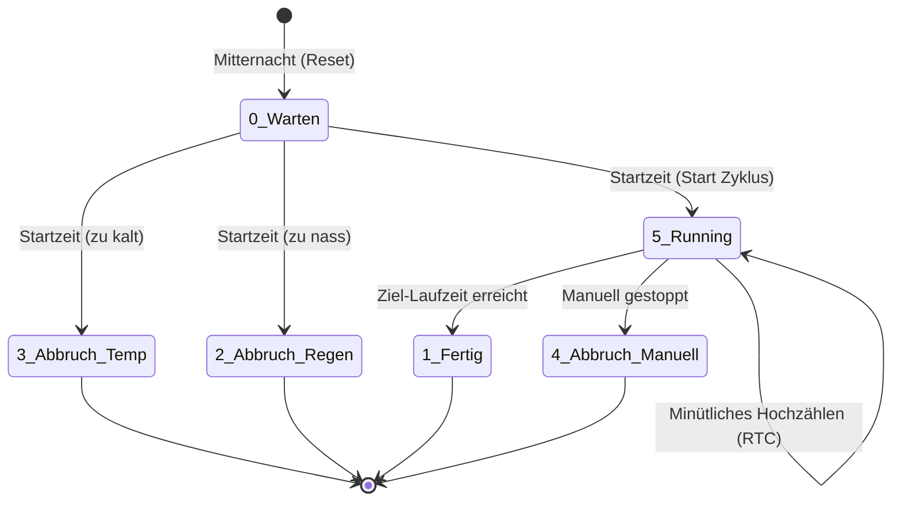

# 🌱 HA-Irrigation – Intelligente Bewässerungssteuerung


[](https://esphome.io/)
[](https://opensource.org/licenses/MIT)

Eine ESPHome-basierte, vollautomatische Bewässerungssteuerung mit regenabhängiger Laufzeitberechnung, Temperaturüberwachung und umfangreicher Sicherheitslogik.

---

## ⚠️ Haftungsausschluss (Disclaimer)

**WICHTIGER HINWEIS: VERWENDUNG AUF EIGENE GEFAHR!**

Dieses Projekt beschreibt ein privates Bastelprojekt zur Automatisierung der Gartenbewässerung. Die Nutzung, der Nachbau sowie das Einspielen des bereitgestellten Codes und der Konfigurationen erfolgen ausdrücklich auf **eigene Gefahr und eigenes Risiko**. 

Der Autor übernimmt **keinerlei Haftung, Gewährleistung oder Verantwortung** für:
* **Wasserschäden oder Folgeschäden** durch Fehlfunktionen der Steuerung (z. B. Überflutung des Gartens oder Wassereinbruch im Haus durch offene Ventile, defekte Sensoren, Relais-Fehler oder Softwarefehler).
* **Schäden jeglicher Art** an Magnetventilen, Wasserleitungen, Pumpen oder anderen Komponenten der Wasserinstallation.
* **Elektrische Unfälle**: Die Kombination aus Strom und Wasser erfordert besondere Vorsicht (auch bei 12V/24V Ventilsteuerungen). Elektroinstallationen im Außenbereich oder Feuchtraum müssen fachgerecht ausgeführt und entsprechend abgesichert sein (FI-Schalter).
* Die Richtigkeit oder Vollständigkeit des bereitgestellten Codes und der Dokumentation.

Mit der Verwendung dieses Codes oder Nachbau der Hardware erklärst du dich damit einverstanden, auf jegliche Schadensersatzansprüche gegenüber dem Autor zu verzichten.

---

## 📋 Inhaltsverzeichnis

* [Überblick](#überblick)
* [Hardware](#hardware)
* [Funktionsweise & State Machine](#funktionsweise--state-machine)
* [Bewässerungsalgorithmus](#bewässerungsalgorithmus)
* [Betriebsmodi](#betriebsmodi)
* [Sicherheitsmechanismen](#sicherheitsmechanismen)
* [Status & Logging](#status--logging)
* [Konfigurationsparameter](#konfigurationsparameter)
* [Home Assistant Integration](#home-assistant-integration)
* [Dashboard](#dashboard)
* [Installation](#installation)

---

## 🔭 Überblick

Das System steuert bis zu **4 Bewässerungsventile** basierend auf:

* ☀️ **Sonnenaufgang** als Startzeitpunkt
* 🌧️ **Regenhistorie** der letzten 48 Stunden
* 🌡️ **Temperatur** als Mindestvoraussetzung
* 📅 **Saisonale Begrenzung** (konfigurierbare Monate)

Die Bewässerungsdauer wird täglich neu berechnet und passt sich dynamisch den Wetterbedingungen an. Das System ist ausfallsicher aufgebaut und verfügt über eine **Resume-Fähigkeit** nach Verbindungsabbrüchen.

---

## 🔌 Hardware

Die Ventil-Outputs sind **invertiert** (active-low Relais).

| Komponente | Pin | Funktion |
| :--- | :--- | :--- |
| **ESP8266** | D1 Mini | Mikrocontroller |
| **Ventil 1** | GPIO5 | Rasen Zone 1 |
| **Ventil 2** | GPIO4 | Rasen Zone 2 |
| **Ventil 3** | GPIO14 | Rasen Zone 3 |
| **Ventil 4** | GPIO16 | Rasen Zone 4 |
| **Status LED** | GPIO0 | Systemstatus (automatisch) |
| **Activity LED**| GPIO2 | Bewässerung aktiv (Puls-Effekt) |
| **Unused LED** | GPIO12 | Deaktiviert (D6) |
| **Unused LED** | GPIO13 | Deaktiviert (D7) |

---

## ⚙️ Funktionsweise & State Machine

### Architektur (Zustandsautomat)
Ab Version 1.1.0 arbeitet das System als deterministische State Machine. Der Tagesstatus wird sicher im Flash-Speicher abgelegt, während die gelaufenen Minuten schonend im RTC-RAM (Real-Time Clock Memory) hochgezählt werden. 

Dies ermöglicht die **Resume-Fähigkeit**: Fällt der ESP während der Bewässerung aus (z. B. durch einen Home Assistant Neustart oder WLAN-Verlust), weiß er nach dem Reboot genau, wie viele Minuten noch fehlen, und setzt den Zyklus nahtlos fort.



### Der Bewässerungszyklus

Sobald der Zyklus gestartet ist (Wechsel auf Status `5_Running`), wird die Dauer ermittelt und geprüft, ob eine Bewässerung sicher und nötig ist:

```text
[ START BERECHNUNG ]
   │
   ├─ 1. Temperatur-Check (Temp < Min?) ───────▶ ABBRUCH
   │
   ├─ 2. Dauer berechnen (siehe Algorithmus) ──▶ Dauer = 0? ──▶ ABBRUCH
   │
   ├─ 3. Aktive Ventile ermitteln (Modus = "Automatik")
   │
   ├─ 4. Ventile öffnen
   │
   ├─ 5. Laufzeit minütlich im RTC-Speicher hochzählen
   │
   ▼
[ Zielzeit erreicht: Alle Ventile schliessen ]
```

---

## 🧠 Bewässerungsalgorithmus

Der Algorithmus reduziert die Bewässerungsdauer proportional zur Regenmenge der letzten 48 Stunden. Dabei wird **neuerer Regen stärker gewichtet** als älterer. Die Logik dahinter: Regen vor 2 Stunden hat den Boden stärker durchfeuchtet als Regen von gestern.

### 1. Regen-Zonen aufteilen
Die Regenhistorie wird in drei Zeitfenster unterteilt:

| Zone | Zeitfenster | Berechnung | Gewichtung |
| :--- | :--- | :--- | :--- |
| **Zone 1** | Letzte 0–12h | `rain_12h` | **× 1.0** (volle Wirkung) |
| **Zone 2** | Vor 12–24h | `rain_24h - rain_12h` | **× 0.5** (halbe Wirkung) |
| **Zone 3** | Vor 24–48h | `rain_48h - rain_24h` | **× 0.25** (viertel Wirkung) |

> **Beispiel:**
> In den letzten 12h: 0.5h Regen. Gesamte 24h: 1.2h. Gesamte 48h: 2.0h.
> * Zone 1 = 0.50 h
> * Zone 2 = 1.20 - 0.50 = 0.70 h
> * Zone 3 = 2.00 - 1.20 = 0.80 h

### 2. Regen-Score berechnen
Der Score summiert die gewichteten Regen-Zonen auf.
`Score = (Zone 1 × 1.0) + (Zone 2 × 0.5) + (Zone 3 × 0.25)`

### 3. Nässe-Faktor berechnen
Der Score wird gegen das **Sättigungslimit** verglichen:
* Wenn Score ≥ Limit → Nässe-Faktor = **0.0** (keine Bewässerung).
* Wenn Score < Limit → Nässe-Faktor = **1.0 - (Score / Limit)**.

| Score (Beispiele) | Limit | Nässe-Faktor | Bedeutung |
| :--- | :--- | :--- | :--- |
| 0.00 | 1.0 | **1.00** | Komplett trocken → 100% Bewässerung |
| 0.50 | 1.0 | **0.50** | Mässiger Regen → 50% Bewässerung |
| 1.00 | 1.0 | **0.00** | Sättigung erreicht → keine Bewässerung |

### 4. Finale Dauer berechnen & Safety Cap
Die endgültige Laufzeit wird berechnet und durch den "Safety Cap" begrenzt (darf nie das Not-Aus-Timeout überschreiten).

`Dauer = Basis-Laufzeit × Nässe-Faktor × (Tuning / 100)`
```text
> `Regen-Score: 0 ─────────────────────────────── Limit (z.B. 1.0)`
> `             │███████████████░░░░░░░░░░░░░░░│`
> `             ↑                              ↑`
> `          Trocken                       Gesättigt`
> `        (100% Dauer)                    (0% Dauer)`
```
---

## 🎛️ Betriebsmodi

* **Automatik-Modus:** Ventil nimmt am täglichen Auto-Zyklus teil. Startzeit: Sonnenaufgang + Offset. Dauer: Dynamisch berechnet.
* **Deaktiviert:** Ventil wird im Auto-Zyklus übersprungen. Manuelle Steuerung bleibt möglich.
* **Modus Alle (Master):** Setzt alle 4 Einzel-Betriebsmodi gleichzeitig (überschreibt die Einzelauswahl).
* **Alle Ventile (Master):** Öffnet/schliesst alle Ventile gleichzeitig manuell.

---

## 🛡️ Sicherheitsmechanismen

Die Sicherheit ist in mehreren Ebenen tief im Code verankert:

1. **Safety Cap:** Die berechnete Auto-Dauer wird hart auf das Not-Aus-Limit gekappt.
2. **Manuelles Timeout:** Schliesst manuell geöffnete Ventile nach X Minuten automatisch.
3. **Not-Aus (Safety Timeout):** Letztes Sicherheitsnetz pro Ventil. Hat IMMER Vorrang und beendet ein klemmendes Skript.
4. **Temperatur-Mindestgrenze:** Verhindert das Bewässern bei Frost oder Kälte.
5. **Tages-Sperre:** Verhindert Mehrfach-Auslösungen am selben Tag.
6. **Ausfallsicherheit & Resume:** Durch die Verknüpfung von Flash- und RTC-Speicher macht die Anlage nach einem Soft-Reboot exakt da weiter, wo sie unterbrochen wurde.

---

## 📊 Status & Logging

### Spam-freies Logbuch & Boot-Recovery
Der Status wird ressourcenschonend und spam-frei an Home Assistant übermittelt. Um das HA-Logbuch sauber zu halten, werden periodische (unnötige) "Standby"-Meldungen um Mitternacht komplett unterdrückt. 

Bei einem ESP-Neustart wird die exakte letzte Statusmeldung aus dem State-Machine-Speicher rekonstruiert (*Boot-Recovery*). Liegt kein spezieller Status vor (z. B. nach einem frischen Boot am Tag), meldet das System einmalig "Bereit", um den initialen `unknown`-Status in Home Assistant zu verhindern.

### Activity-Log Meldungen
| Ereignis | Beispiel-Meldung (Sensor Status) |
| :--- | :--- |
| **System-Boot** | `Bereit` |
| **Zyklus Start** | `Zyklus läuft: 12.0 Min, Score 0.42 (V1,V2,V4)` |
| **Wiederaufnahme**| `Zyklus läuft (Wiederaufnahme)` |
| **Zyklus Ende** | `Zyklus beendet (12 Min gelaufen)` |
| **Abbruch Temp.** | `Abbruch: Temp 8.2°C unter Limit 10.0°C` |
| **Abbruch Regen** | `Abbruch: Regen-Sättigung (Score 1.25)` |
| **Manuell aus** | `Manuell: V1 geschlossen nach 0.3 Min` |
| **Master aus** | `Manuell: Alle geschlossen nach 3.2 Min (V1,V2,V3,V4)` |
| **NOT-AUS** | `NOT-AUS: Ventil 1 nach 45 Min zwangsgeschlossen!` |

---

## 🛠️ Konfigurationsparameter (aus dem Dashboard)

Alle Einstellungen sind direkt in Home Assistant veränderbar:

| Parameter | Default | Bereich | Beschreibung |
| :--- | :--- | :--- | :--- |
| **Basis Laufzeit** | 15 Min | 1–60 | Maximale Dauer bei komplett trockenem Boden. |
| **Wasser Tuning** | 100 % | 0–200 | Skalierungsfaktor (50% = Wassersparend, 200% = Intensiv). |
| **Regen Sättigung** | 1.0 Score | 0.1–5.0 | Limit, ab dem keine automatische Bewässerung startet. |
| **Min Temperatur** | 10.0 °C | 0–25 | Unter diesem Wert: kein Bewässern. |
| **Saison Start/Ende** | 5 bis 9 | 1–12 | Aktive Monate (Standard: Mai bis September). |
| **Sonne Offset** | 0 Min | -120–120| Offset zum Sonnenaufgang (Negativ = Start davor). |
| **Manuelles Timeout**| 15 Min | 1–60 | Auto-Abschaltung bei manuellem Einschalten. |
| **Not-Aus Timeout** | 45 Min | 5–120 | Absolute Maximalzeit pro Ventil. |

---

## 🏠 Home Assistant Integration

Das System importiert zwingend diese **Sensoren aus Home Assistant** (diese müssen im System vorhanden sein):

* `sensor.regendauer_letzte_12h`
* `sensor.regendauer_letzte_24h`
* `sensor.regendauer_letzte_48h`
* `sensor.aussen_temperatur`

---

## 📱 Dashboard

Für ein übersichtliches Interface werden die HACS-Karten `mushroom-cards`, `fold-entity-row` und `logbook-card` (von *royto*) empfohlen. Kopiere den folgenden YAML-Code in dein Lovelace-Dashboard:

```yaml
- type: sections
  max_columns: 2
  title: Garten
  path: garten
  icon: mdi:shovel
  sections:
    - type: grid
      cards:
        - type: custom:mushroom-title-card
          title: 💦 Bewässerung
          subtitle: Automatische Rasenbewässerung
        - type: custom:logbook-card
          entity: sensor.ha_irrigation_status
          title: 📋 Status
          hours_to_show: 168
          hidden_state:
            - unavailable
            - unknown
        - type: custom:mushroom-select-card
          entity: select.ha_irrigation_modus_alle
          name: Betriebsmodus
          icon: mdi:valve-open
          fill_container: true
          layout: horizontal
        - type: custom:mushroom-entity-card
          entity: switch.ha_irrigation_alle_ventile
          name: Alle Ventile
          icon: mdi:water
          tap_action:
            action: toggle
          fill_container: true
          layout: horizontal
        - type: custom:fold-entity-row
          head:
            type: section
            label: 🚿 Einzelventile & Modus
          entities:
            - type: section
              label: Manuell schalten
            - entity: switch.ha_irrigation_ventil_rasen_1
              name: Zone 1
            - entity: switch.ha_irrigation_ventil_rasen_2
              name: Zone 2
            - entity: switch.ha_irrigation_ventil_rasen_3
              name: Zone 3
            - entity: switch.ha_irrigation_ventil_rasen_4
              name: Zone 4
            - type: section
              label: Betriebsmodus einzeln
            - entity: select.ha_irrigation_modus_ventil_1
              name: Zone 1
            - entity: select.ha_irrigation_modus_ventil_2
              name: Zone 2
            - entity: select.ha_irrigation_modus_ventil_3
              name: Zone 3
            - entity: select.ha_irrigation_modus_ventil_4
              name: Zone 4
        - type: custom:fold-entity-row
          head:
            type: section
            label: ⚙️ Konfiguration
          entities:
            - type: section
              label: Zeiten & Bewässerung
            - entity: number.ha_irrigation_basis_laufzeit_min
              name: Basis Laufzeit (Min)
            - entity: number.ha_irrigation_manuelles_timeout_min
              name: Manuelles Timeout (Min)
            - entity: number.ha_irrigation_wasser_tuning
              name: Tuning Faktor (%)
            - entity: number.ha_irrigation_regen_sattigung_score
              name: Regen Sättigung
            - entity: number.ha_irrigation_min_temperatur_degc
              name: Min. Temperatur (°C)
            - type: section
              label: Saison & Startzeit
            - entity: number.ha_irrigation_saison_start_monat
              name: Start Monat
            - entity: number.ha_irrigation_saison_ende_monat
              name: Ende Monat
            - entity: number.ha_irrigation_start_versatz_sonne_min
              name: Start Versatz Sonne (Min)
            - type: section
              label: Sicherheit
            - entity: number.ha_irrigation_not_aus_timeout_min
              name: Not-Aus Timeout (Min)
            - type: section
              label: System
            - entity: button.ha_irrigation_neustart
              name: Neustart
```

---

## 🚀 Installation

### 1. Voraussetzungen prüfen
* ESPHome installiert (als HA Add-on oder via CLI).
* ESP8266 D1 Mini mit 4-Kanal Relais ist physisch verdrahtet.
* WLAN-Zugang ist konfiguriert (via `secrets.yaml`).
* Die benötigten Wettersensoren existieren in Home Assistant.

### 2. Secrets anlegen
Falls noch nicht vorhanden, lege in deinem ESPHome Ordner eine Datei `secrets.yaml` an:
```yaml
wifi_ssid: "DEIN_WLAN"
wifi_password: "DEIN_PASSWORT"
```

### 3. Flashen
Kopiere die Datei `ha_irrigation.yaml` in deinen ESPHome-Konfigurationsordner und flashe den ESP:
```bash
esphome run ha_irrigation.yaml
```

### 4. Integration und Abschluss
1. **In HA integrieren:** Das Gerät wird nach dem Neustart automatisch in Home Assistant erkannt → Auf “Konfigurieren” (Configure) klicken.
2. **Dashboard einrichten:** Den Lovelace-Code (siehe oben) als manuelle Karte hinzufügen.
3. **Standort-Check:** Die `sun`-Komponente berechnet den Sonnenaufgang für Koordinaten in der Schweiz (47.5505°N, 9.3866°E). Falls du in einer anderen Region wohnst, passe `latitude` und `longitude` im Code an.

---

## ⚖️ Lizenz

Dieses Projekt ist unter der **MIT-Lizenz** veröffentlicht. Das bedeutet, du darfst den Code für private und kommerzielle Zwecke frei verwenden, kopieren, verändern und weitergeben, solange der ursprüngliche Copyright-Hinweis und der Lizenztext beibehalten werden.
